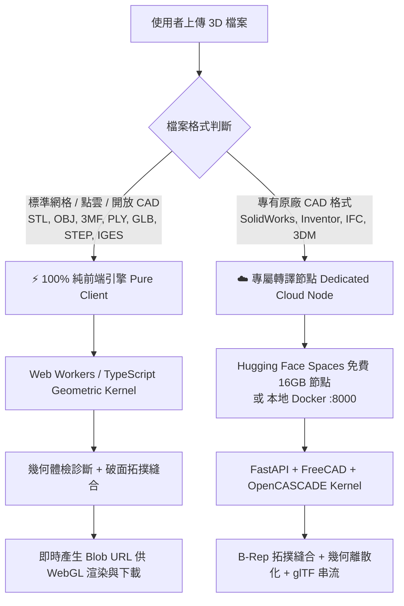

# OmniSeam 3D (寰縫幾何) - 核心架構與開發歷程檔案 (Agent Knowledge Base)

> **本檔案為 OmniSeam 3D 專案的永久開發日誌與架構決策知識庫。**  
> 任何 AI Agent、開發者在接手本專案時，**請務必先閱讀本檔案**，以避免重複踩坑、重複發想或浪費 Token 重新摸索已定案的架構。

---

## 🏛️ 1. 專案核心定位與基礎架構

### 1.1 專案識別
- **名稱**：**OmniSeam 3D**（寰縫幾何 / 全維無縫 3D）
- **授權**：100% 開源無授權費（FOSS）
- **遠端倉庫**：`https://github.com/hauchiehlin-ops/OmniSeam-3D.git`
- **線上前端部署**：`https://omniseam-3d.vercel.app`

### 1.2 雙引擎架構設計 (Dual-Engine Architecture)
為兼顧「**$0 雲端伺服器成本 + 100% 使用者隱私**」與「**重度專有 CAD 格式解析**」，本專案採取雙引擎設計：



1. **⚡ 純前端離線引擎（預設）**：
   - 位於 `frontend/src/engine/`。
   - 完全在瀏覽器內部執行（Web Workers + Three.js 幾何核心），模型不離開本機，$0 伺服器成本。
   - 支援格式：STL, OBJ, 3MF, PLY, OFF, DXF, GLTF/GLB, 以及 STEP/IGES 的離散網格。
2. **☁️ 專屬轉譯節點（使用者自選/解鎖）**：
   - 位於 `backend/`（FastAPI + FreeCAD + OpenCASCADE + Trimesh）。
   - 免費方案首選：**Hugging Face Spaces (Docker Space)** 提供 **16 GB RAM + 2 vCPU 免費節點**（無須信用卡）。
   - 本地方案：`docker-compose up -d` 或 `docker run -d -p 8000:8000 ...`。
   - 處理格式：SolidWorks (`.sldprt`, `.sldasm`), Inventor (`.ipt`), BIM (`.ifc`), Rhino (`.3dm`)。

---

## 🛠️ 2. 版本演進與詳細修改歷程 (Version History)

### `v1.0.13` (2026-09-04) - 修復 Hugging Face Spaces 現代 Debian 套件相依性
- **問題根因**：
  - Hugging Face Spaces 採用現代 Debian（Bookworm / Trixie），舊版的 `libgl1-mesa-glx` 已被淘汰無安裝候選包，導致構建報錯 `Package 'libgl1-mesa-glx' has no installation candidate`。
- **修復方案**：
  - 將 `packages.txt` 與 `backend/Dockerfile` 的 `libgl1-mesa-glx` 全面替換為現代標準套件 `libgl1` 與 `libglx-mesa0`。

### `v1.0.12` (2026-09-04) - 面向大眾使用者的「一鍵 Duplicate 複製官方免費節點」極簡流程
- **轉譯節點設定流程重構（徹底消除終端機與檔案上傳門檻）**：
  - 一般大眾使用者完全無需懂 Git、無需安裝任何工具，亦無需手動拖放上傳代碼。
  - **1-Click Duplicate Space 機制**：點擊按鈕直接開啟官方模板（`https://huggingface.co/spaces/hauchieh/omniseam-engine?duplicate=true`），一鍵複製整個 16GB FreeCAD 引擎到個人免費帳號。
  - 新增「填入官方公共示範節點」快捷按鈕，支援免設定立即體驗。
  - 介面文案全面重構為直覺的 3 步驟圖文指引。

### `v1.0.11` (2026-09-04) - 提供腳本自動同步至 Hugging Face Spaces
- 新增 `scripts/deploy_to_hf.sh` 供維護者與工程師一鍵同步整個後端代碼庫。

### `v1.0.10` / `v1.0.9` (2026-09-04) - Hugging Face Spaces Gradio SDK 100% 免費轉譯節點適配
- **解決 Hugging Face Docker "🔒 Paid" 限制**：
  - Hugging Face 近期將建立 Docker Space 設為付費鎖定（Paid）。
  - **方案全面適配 Gradio Blank SDK（100% 免費，無需信用卡，提供 16GB RAM + 2 vCPU）**：
    - Gradio 本身底層即為 FastAPI 服務端。
    - 新增 `app.py` 與 `backend/app.py`：將 OmniSeam 3D FastAPI 路由 (`/api/v1/...`)、Swagger 文檔 (`/docs`) 與 Gradio 儀表板無縫掛載於 7860 埠。
    - 新增 `packages.txt`：自動由 Hugging Face 原生安裝 `freecad`、`libgl1` 等系統級幾何底層依賴。
    - 更新 `BackendSettingsModal.tsx` 引導文案，指引使用者點選 `Gradio (Template: Blank)` 100% 免費解鎖專屬節點。

### `v1.0.8` (2026-09-04) - 透明背景高對比 Icon 視覺升級
- **Icon 背景去背與主體凸顯**：
  - 應用程式圖標（`frontend/src/assets/logo.png`, `frontend/public/logo.png`, `frontend/public/favicon.png`, `frontend/public/favicon.ico`）全面更新為 **100% 純透明背景（RGBA 864x864）**。
  - 移除舊版灰色實心背景，完美突顯「左側電光藍發光拓撲網格線框 + 縫合節點 + 右側高光鈦金屬多面體」核心水晶實體。
  - 導覽列（Navbar）更新為 `drop-shadow-[0_0_12px_rgba(56,189,248,0.35)]` 發光立體效果，大幅提升在暗色 UI 與瀏覽器標籤頁上的辨識度。

### `v1.0.7` (2026-09-04) - 建立全方位開發日誌與知識庫
- **新增 `DEVELOPMENT_LOG.md`**：建立專案專屬永久開發知識庫，收錄架構圖、雙引擎分工、踩坑指南與版本歷程。

### `v1.0.6` (2026-09-04) - Hugging Face 專屬轉譯節點與原生 CAD 解鎖
- **新增 `BackendSettingsModal.tsx`**：
  - 🚀 **Hugging Face Spaces 分頁**：提供一鍵直達申請頁面、4 步驟配置引導（Docker Blank SDK、16GB 免費規格）、URL 輸入框與「⚡ 測試連線」功能（即時回報延遲 ms、FreeCAD/OpenCASCADE 支援度與冷啟動喚醒提示）。
  - 💻 **本地 Docker 分頁**：一鍵複製啟動指令，預設連接 `http://localhost:8000`。
  - ⚡ **純前端模式分頁**：說明 100% 離線運算與隱私保護。
- **新增 `CadUnlockModal.tsx`**：
  - 當使用者在純前端模式上傳 `.sldprt`/`.sldasm`/`.ipt`/`.ifc` 等封閉格式時，主動彈出解鎖引導，提供「方案 A：免費連接 Hugging Face 專屬節點」與「方案 B：在 CAD 中另存為 STEP/STL」兩種明確路徑。
- **後端適配 Hugging Face Spaces 規範**：
  - `backend/Dockerfile` 支援 `${PORT:-7860}` 動態環境變數。
  - `backend/README.md` 內建 Hugging Face Spaces YAML 前置元數據（`sdk: docker`, `app_port: 7860`）。
  - `backend/app/api/v1/health.py` 增強健康診斷輸出，回報 FreeCAD 模組載入狀態與運作時間。
- **動態 API 路由 (`frontend/src/api/client.ts`)**：
  - 支援 `localStorage` 持久化儲存轉譯節點網址，自動轉發上傳、體檢與 WebGL 串流請求。
- **導覽列（Navbar）**：
  - 頂部導覽列即時展示目前連線狀態（如 `⚡ 100% Pure Client` 或 `🚀 HF Space Node (16GB)`），點擊即可快速開啟節點管理。

### `v1.0.5` (2026-09-04) - 修復純前端下載 index.html 缺陷
- **問題根因**：
  - 純前端模式下點擊「下載轉換完成檔案」時，由於相對路徑 `/api/v1/tasks/{id}/download` 在 Vercel 靜態環境無後端，被 Vercel SPA 重定向至 `index.html`。
- **修復方案**：
  - `ClientPipeline` 在前端轉換完成後，將轉換出來的檔案二進制生成 `blob:` URL（`URL.createObjectURL(blob)`），直接附加在 `TaskResponse.download_url` 與 `preview_url`。
  - 前端下載按鈕使用動態 `<a>` 標籤並指定檔案名稱與副檔名，確保下載為真實的 3D 模型檔案。

### `v1.0.4` (2026-09-04) - 解決 Vercel Root Directory 編譯衝突
- **問題根因**：
  - 倉庫根目錄原本存在 `package.json`，而 Vercel 專案設定 Root Directory 為根目錄時，嘗試在根目錄執行 `npm run build` 導致找不到路徑錯誤。
- **修復方案**：
  - 在根目錄 `vercel.json` 明確指定 `buildCommand: "npm --prefix frontend run build"` 與 `outputDirectory: "frontend/dist"`。
  - 確保 Vercel 無論 Root Directory 設定在根目錄或 `frontend` 均能自動正確構建。

### `v1.0.3` (2026-09-04) - 品牌與視覺識別定案
- **決定品牌識別**：正式命名為 **OmniSeam 3D**（寰縫幾何）。
- **視覺 Icon 定案**：採用 Proposal C（電光藍晶體結構與金屬實體轉換 Hexagonal Crystal 圖標）。
- **雙語系繁體中文與英文**：全面配置 `zh-TW` 與 `en` 雙語。

### `v1.0.1` ~ `v1.0.2` (2026-09-04) - 自動化版本號遞增與測試發版腳本
- **建立自動化流程**：
  - `scripts/bump_version.py`：自動同步更新 `frontend/package.json`、`frontend/src/version.ts`、`backend/app/config.py`、`backend/pyproject.toml`。
  - `scripts/run_tests.sh`：一鍵執行後端 Pytest 9 項幾何測試與前端 Vite 生產編譯。
  - `scripts/bump_and_push.sh`：一鍵更新版本號（預設 patch）、執行全套測試、自動建立 Git Tag 並推送至 GitHub。

### `v1.0.0` (2026-09-04) - 初始雙引擎架構原型
- **後端核心 (`backend/`)**：
  - FreeCAD/OpenCASCADE B-Rep 縫合、離散化 (`cad_engine.py`)。
  - 網格自動修復核心（破洞補平、非流形修復、法向量統一、頂點融合、退化面清除）。
  - RESTful API：`/api/v1/inspect`, `/api/v1/convert`, `/api/v1/tasks/{id}`, `/api/v1/health`。
- **前端核心 (`frontend/`)**：
  - Three.js 雙分屏視圖（Before / After 對比）。
  - 3D 距離量測標尺、即時剖面分析 (Section Plane)、爆炸圖視圖。
  - 幾何健康體檢報告 (Audit Report) 彈窗。

---

## ⚠️ 3. 關鍵技術踩坑與 Agent 避坑指南 (Gotchas & Rules)

### 3.1 終端命令沙盒 (Sandbox Execution)
- **問題**：沙盒環境預設阻擋對外網路連線（如 `git push` 會報錯 `Could not resolve host: github.com`）。
- **規則**：
  - 本地測試、編譯（`npm run build`、`pytest`、`git commit`）應使用一般模式（`BypassSandbox: false`）。
  - 僅在需要與 GitHub 遠端網路通訊（`git push`、`git pull`）時，才將 `BypassSandbox` 設為 `true`。

### 3.2 Vercel 靜態前端 vs. FastAPI 後端路由
- **規則**：
  - Vercel 僅負責託管純靜態 React 前端（`frontend/dist`）。
  - **絕對不能**依賴相對路徑 `/api/v1` 去請求伺服器功能，除非使用者已經在設定中指定了自訂後端節點（`customBackendUrl`）。
  - 所有下載、預覽均須優先支援純前端記憶體 `Blob URL`。

### 3.3 Hugging Face Spaces 容器配置
- **規則**：
  - Hugging Face Spaces 的 Docker 容器必須監聽 `$PORT` 環境變數（預設 `7860`）。
  - `backend/Dockerfile` 必須寫成 `CMD ["sh", "-c", "uvicorn backend.app.main:app --host 0.0.0.0 --port ${PORT:-7860}"]`。
  - CORS 設定在 `backend/app/config.py` 必須包含 `*` 或動態允許所有來源，以允許 Vercel 前端跨域呼叫。

### 3.4 版本號自動發布守則
- 每次修改程式碼完成並測試通過後，一律使用：
  ```bash
  ./scripts/bump_and_push.sh patch "commit 說明文字"
  ```
  該腳本會自動完成：版本升級 -> Pytest 測試 -> Vite 打包 -> Git 提交 -> Git 打 Tag -> 推送遠端。

---

## 📋 4. 目錄結構速查表 (Directory Map)

```
OmniSeam-3D/
├── DEVELOPMENT_LOG.md           # 本開發日誌與知識庫檔案
├── README.md                    # 專案主說明文件
├── docker-compose.yml           # 本地完整容器編排
├── vercel.json                  # Vercel 前端部署規則
├── backend/                     # Python 專屬轉譯節點 (FastAPI + FreeCAD + OCCT)
│   ├── Dockerfile               # 支援 Hugging Face Spaces & 本地 Docker
│   ├── README.md                # Hugging Face Spaces YAML 前置模板
│   ├── requirements.txt         # 後端依賴 (FreeCAD, trimesh, open3d 等)
│   ├── app/
│   │   ├── main.py              # FastAPI 進入點
│   │   ├── config.py            # 系統設定與版本號
│   │   ├── api/v1/              # RESTful API 端點 (health, inspect, convert, tasks)
│   │   └── core/                # CAD/Mesh 幾何修復核心引擎
│   └── tests/                   # Pytest 幾何驗證測試套件 (9 項測試)
├── frontend/                    # React 18 + Vite + Three.js + TailwindCSS
│   ├── src/
│   │   ├── api/client.ts        # 雙引擎分發客戶端與動態節點網址管理
│   │   ├── engine/              # 純前端離線 Web Worker / TS 幾何修復核心
│   │   ├── components/          # UI 元件 (Viewer3D, SplitViewer3D, BackendSettingsModal, CadUnlockModal 等)
│   │   ├── locales/             # 國際化多國語系 (en, zh-TW)
│   │   └── version.ts           # 前端版本號常數
└── scripts/                     # 自動化發版與測試腳本
    ├── bump_and_push.sh         # 自動化發版主要腳本
    ├── bump_version.py          # 跨前後端版本遞增工具
    └── run_tests.sh             # 自動化測試與構建檢查
```

---

## 🚀 5. 未來迭代規劃 (Backlog)

1. **WebAssembly FreeCAD / OpenCASCADE 深度移植**：評估將 `opencascade.js` 整合入前端 Web Worker，進一步減少對後端節點的依賴。
2. **多檔案批次轉換佇列**：支援同時拖放多個 3D 模型進行並行轉換與批次下載 ZIP。
3. **AR / WebXR 即時預覽**：支援手機端直接以 AR 投影放置修復後的實體模型。
