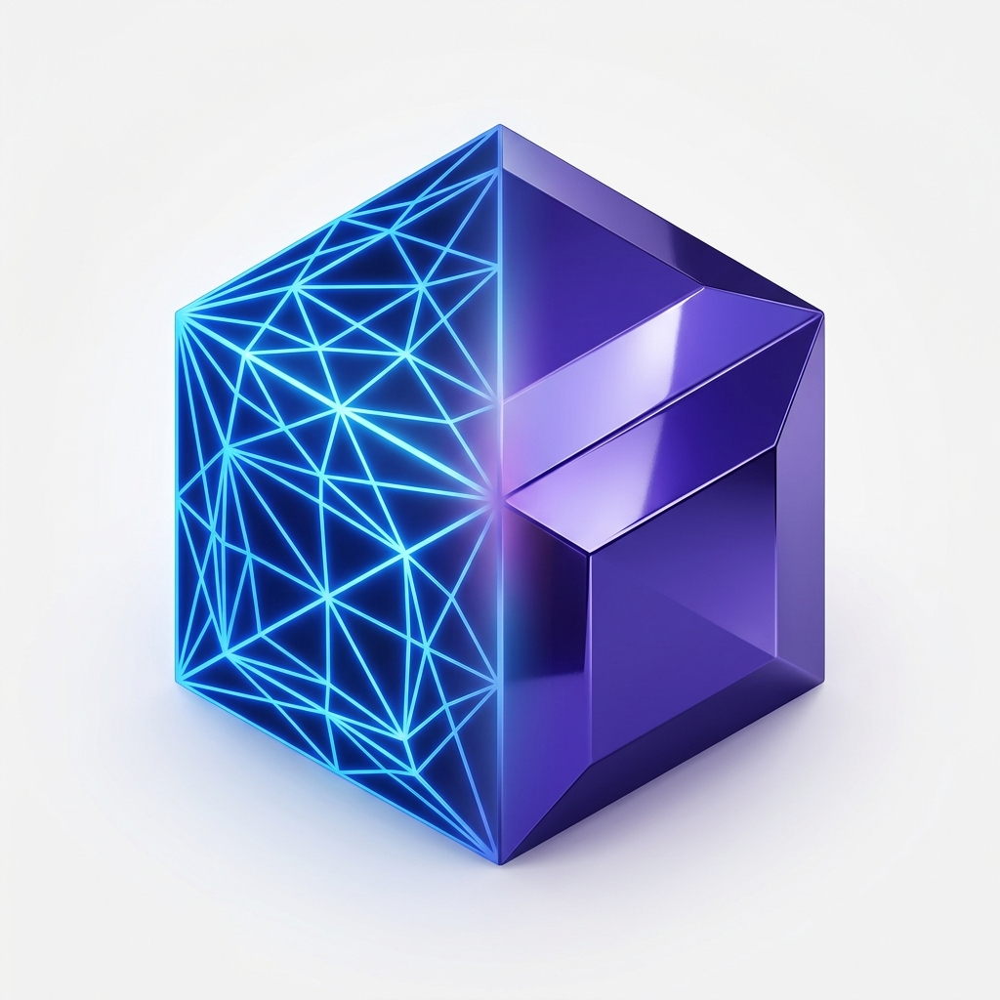

# Universal 3D Model Converter & Auto-Healing Engine (OmniSeam 3D)

<p align="center">
  
</p>

<p align="center">
  <a href="#"></a>
  <a href="https://www.python.org/"></a>
  <a href="https://fastapi.tiangolo.com/"></a>
  <a href="https://threejs.org/"></a>
  <a href="#"></a>
</p>

> **OmniSeam 3D** is an open-source, industrial-grade 3D model universal converter and autonomous geometric defect repair engine. It bridges CAD, Mesh, BIM/AEC, and Point Clouds with automated B-Rep topology sewing, hole filling, non-manifold resolution, and glTF optimization at **$0 licensing cost (100% FOSS)**.

---

## 🌟 Key Features

* **Multi-Domain Format Matrix**:
  * **CAD / B-Rep**: STEP (`.step`, `.stp`), IGES (`.iges`, `.igs`), OpenCASCADE BREP (`.brep`).
  * **Native Mechanical CAD**: SolidWorks (`.sldprt`, `.sldasm`), Rhino (`.3dm`), Autodesk Inventor (`.ipt`, `.iam`).
  * **3D Printing & Mesh**: STL, OBJ, 3MF, PLY, OFF, glTF / GLB.
  * **BIM & Architecture**: IFC (Industry Foundation Classes), AutoCAD DXF/DWG.
  * **DCC & Animation**: FBX, Blender (`.blend`), USD / USDZ, ABC.
  * **Point Cloud 3D Scans**: LAS, PCD, PLY, XYZ (via Poisson Surface Reconstruction).
* **Automated Auto-Healing Pipeline**:
  * **B-Rep Sewing & Deflection**: Sagitta chordal error $\le 0.005\text{ mm}$, angular error $\le 0.1\text{ rad}$.
  * **Boundary Loop Hole Filling**: Automated triangulation & fan-patching to produce 100% watertight solids.
  * **Non-Manifold Geometry Resolution**: Resolves duplicate/collapsed triangles, shared edges, and self-intersections.
  * **Normal Vector Unification**: BFS adjacency traversal ensuring all face normals point outward.
  * **glTF / Draco Quantization**: Reduces 3D asset file size by 70%+ for instant WebGL streaming.
* **Dual-Language Support (i18n)**:
  * Full interface, tooltips, error codes, and audit reports in **English (Default)** and **繁體中文 (Traditional Chinese)**.
* **Interactive 3D Web UI**:
  * Dual-split Before/After comparison view with synchronized camera controls.
  * Real-time defect heatmaps (open holes & non-manifold edges highlighted in red).
  * Section plane clipping with interactive distance slider.
  * 3D Euclidean point-to-point measurement tool & bounding box readout.

---

## 🚀 Quick Start with Docker Compose

```bash
# Clone the repository
git clone https://github.com/barretlin/3DModelConverter.git
cd 3DModelConverter

# Start all services (Backend + Web UI)
docker-compose up -d --build
```

Access the services:
- **Web UI**: [http://localhost:3000](http://localhost:3000)
- **API Swagger Documentation**: [http://localhost:8000/docs](http://localhost:8000/docs)
- **API Alternative ReDoc**: [http://localhost:8000/redoc](http://localhost:8000/redoc)

---

## 🛠️ Local Development Setup

### 1. Backend (FastAPI + Python 3.11+)

```bash
# Set up virtual environment
python3 -m venv .venv
source .venv/bin/activate

# Install dependencies
pip install -r backend/requirements.txt

# Start backend development server
uvicorn backend.app.main:app --reload --port 8000
```

### 2. Frontend (React 18 + Vite + TailwindCSS + Three.js)

```bash
cd frontend
npm install
npm run dev
```

Visit [http://localhost:5173](http://localhost:5173) in your browser.

---

## 🧪 Automated Testing

Run the end-to-end geometry and API verification test suite:

```bash
source .venv/bin/activate
PYTHONPATH=. pytest backend/tests -v
```

---

## 📡 RESTful API Overview

| Method | Endpoint | Description |
| :--- | :--- | :--- |
| `POST` | `/api/v1/convert` | Upload 3D file and trigger conversion/healing pipeline |
| `POST` | `/api/v1/inspect` | Perform geometric defect audit without converting |
| `GET` | `/api/v1/tasks/{task_id}` | Retrieve task progress, status, and health audit report |
| `GET` | `/api/v1/tasks/{task_id}/download` | Download converted target model file |
| `GET` | `/api/v1/tasks/{task_id}/preview` | Stream optimized WebGL binary `.glb` for viewport |
| `GET` | `/api/v1/health` | Service liveness and supported formats check |
