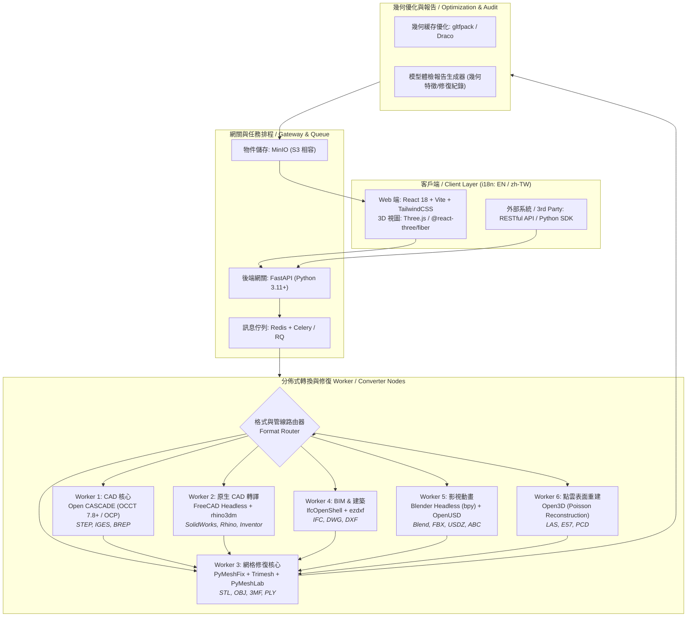

# Universal 3D Model Converter & Auto-Healing Engine (PolyHeal 3D)
## 專案完整實施計劃書 / Full Project Implementation Plan

> **支援語系**：English (Default, 預設) / 繁體中文 (Traditional Chinese, zh-TW)  
> **核心目標**：建構高保真、零授權費（100% FOSS）、支援 CAD（含 SolidWorks）/ 網格 / BIM / 點雲格式互轉與自動幾何缺陷修復（Auto-Healing）的專業 3D 轉換服務。

---

## 1. 專案概述 (Executive Summary)

### 1.1 產品定位
開發一套現代化、跨平台（Web / REST API）的 **3D 模型全格式通用轉換與幾何修復平台**。針對製造、3D 列印、遊戲與建築領域常見的「破面」、「非流形」、「縫隙未閉合」與「專利格式壁壘」等痛點，提供自動拓撲縫合（B-Rep Sewing）、孔洞填補（Hole Filling）、自適應細分（Adaptive Tessellation）與輕量化無損壓縮。

### 1.2 核心指標 (Key Performance Indicators)
* **轉換保真度**：CAD $\to$ Mesh 弦高誤差（Sagitta Error）控制在 $\le 0.005\text{ mm}$，角度偏差 $\le 5^\circ$。
* **修復成功率**：常見 3D 打印與掃描模型破洞/非流形修復率達 $\ge 95\%$（達成 Watertight 實體）。
* **多語系覆蓋**：前端 UI、即時錯誤提示、模型體檢報告完整支援 **English** 與 **繁體中文**。
* **運算授權成本**：底層核心 $0 授權費（全套基於 LGPL/MIT/BSD 開源協議）。

---

## 2. 系統架構與技術棧 (System Architecture & Tech Stack)



---

## 3. 雙語系 (i18n) 系統設計規範

系統預設語言為 **English (`en`)**，支援切換至 **繁體中文 (`zh-TW`)**。

### 3.1 前端 i18n 架構 (`react-i18next`)
* 依據瀏覽器語言自動偵測，可手動切換並保存至 `localStorage`。
* 結構化命名空間（Namespaces）：
  * `common`：通用按鈕、狀態標籤（Processing, Done, Failed）。
  * `viewer`：視圖控制（線框 Wireframe、法向量 Normals、剖面 Section、量測 Measure）。
  * `repair`：修復選項（拓撲縫合 Sewing、填補破洞 Fill Holes、流形重構 Non-manifold Repair）。
  * `report`：模型檢測指標（原始體積 Original Volume、修復後面積 Repaired Area、閉合狀態 Watertight）。

#### 語系範例檔案：`locales/en/translation.json` vs `locales/zh-TW/translation.json`
```json
// locales/en/translation.json
{
  "app_title": "PolyHeal 3D - Universal Model Converter & Repair",
  "upload_zone_hint": "Drag & drop your 3D file here (CAD, Mesh, BIM, Point Cloud)",
  "repair_options": {
    "auto_sewing": "Auto-stitch B-Rep Gaps (Sewing)",
    "fill_holes": "Fill Boundary Holes",
    "fix_non_manifold": "Resolve Non-Manifold Geometry",
    "tessellation_quality": "CAD Tessellation Quality"
  },
  "status": {
    "analyzing": "Analyzing geometry...",
    "repairing": "Repairing mesh defects...",
    "converting": "Exporting target format...",
    "completed": "Conversion Completed"
  },
  "report": {
    "watertight": "Watertight Solid",
    "holes_filled": "Holes Filled: {{count}}",
    "deviation": "Max Surface Deviation: {{val}} mm"
  }
}
```

```json
// locales/zh-TW/translation.json
{
  "app_title": "PolyHeal 3D - 通用幾何模型轉換與自動修復系統",
  "upload_zone_hint": "拖放 3D 檔案至此處（支援 CAD、網格、BIM、點雲格式）",
  "repair_options": {
    "auto_sewing": "自動拓撲縫合 (B-Rep 縫隙補平)",
    "fill_holes": "封閉邊界孔洞",
    "fix_non_manifold": "修復非流形 (Non-Manifold) 缺陷",
    "tessellation_quality": "CAD 離散化精細度"
  },
  "status": {
    "analyzing": "正在分析模型幾何結構...",
    "repairing": "正在自動修復幾何缺陷...",
    "converting": "正在匯出目標格式...",
    "completed": "轉換與修復完成"
  },
  "report": {
    "watertight": "封閉實體 (Watertight)",
    "holes_filled": "修復孔洞數量：{{count}} 個",
    "deviation": "最大曲面誤差：{{val}} mm"
  }
}
```

### 3.2 後端錯誤代碼與報告雙語化
API 傳回之 Error 與 Report 均以標準結構化 Code 輸出，並附帶語系描述字串：
```json
{
  "code": "GEOM_OPEN_SHELL_DETECTED",
  "message": "Model contains open shells and is not a closed solid.",
  "i18n_key": "errors.geom_open_shell_detected",
  "details": {
    "open_boundary_loops": 3,
    "suggested_action": "Enable 'auto_sewing' or 'fill_holes'"
  }
}
```

---

## 4. 核心演算法管線設計 (Pipeline Implementation)

### 4.1 CAD B-Rep 縫合與自適應細分演算法
1. **拓撲容差修正（Tolerance Tuning）**：透過 `BRepBuilderAPI_Sewing` 將離散曲面縫合為 Shell，公差範圍預設 $1\times 10^{-3}\text{ mm}$。
2. **退化實體清理（ShapeFix）**：執行 `ShapeFix_Shape` 消除零長度邊（Degenerated Edges）與微小縫隙。
3. **無損弦高差細分（BRepMesh）**：
   $$\text{Deflection}_{\text{linear}} \le 0.005\text{ mm}, \quad \text{Deflection}_{\text{angular}} \le 0.1\text{ rad}$$
   保證曲面轉為網格時無鋸齒感。

### 4.2 網格自動補洞與流形重構（Mesh Repairing）
1. **邊界環檢索（Boundary Loop Detection）**：檢測模型中的開放邊界，若環長小於閾值則執行 Delaunay 三角劃分補平。
2. **非流形消除（PyMeshFix / J.Burkardt's Algorithm）**：分離共用頂點、解開自相交面（Self-intersections）。
3. **法向量統一（Consistent Normal Orientation）**：採用 BFS 走訪連通分量，確保所有面之法向朝外（Outward Normals）。

### 4.3 輕量化壓縮（Mesh Optimization）
* 針對 Web 預覽與 glTF 匯出，使用 `gltfpack` 啟用頂點快取重排與量化無損壓縮（Quantization），將傳輸體積縮減 70% 以上。

---

## 5. API 介面規格 (RESTful API Specification)

### 5.1 主要介面列表
| HTTP Method | 路由端點 | 功能說明 |
| :--- | :--- | :--- |
| `POST` | `/api/v1/convert` | 上傳模型並建立非同步轉換/修復任務 |
| `GET` | `/api/v1/tasks/{task_id}` | 查詢轉換進度、處理狀態與修復報告 |
| `GET` | `/api/v1/tasks/{task_id}/download` | 下載轉換後的目標格式檔案 |
| `GET` | `/api/v1/tasks/{task_id}/preview` | 取得優化後的 WebGL 串流檔 (`.glb`) |
| `POST` | `/api/v1/inspect` | 僅分析模型缺陷（不轉換，回傳幾何健康診斷） |

### 5.2 轉換請求參數範例 (`POST /api/v1/convert`)
```json
{
  "target_format": "gltf",
  "cad_options": {
    "linear_deflection": 0.005,
    "angular_deflection": 0.1,
    "enable_sewing": true,
    "sewing_tolerance": 0.001
  },
  "repair_options": {
    "auto_fill_holes": true,
    "fix_non_manifold": true,
    "unify_normals": true
  },
  "output_options": {
    "compress_gltf": true,
    "language": "en"
  }
}
```

---

## 6. 前端 3D 視圖與模型診斷介面 (Web UI Specification)

1. **拖放上傳區（Universal Dropzone）**：支援一次拖入多個檔案（例如 SolidWorks 裝配體 `.sldasm` 及子零件 `.sldprt`）。
2. **雙分屏對比視圖（Before / After Split View）**：
   * 左側：原始模型（紅色高亮標註破面、孔洞與非流形邊）。
   * 右側：修復後模型（綠色標註修復成功的區域）。
3. **專業工具箱（CAD / Inspection Tools）**：
   * 爆炸圖視圖（Exploded View, 適用於裝配體）。
   * 即時剖面器（Section Plane Analysis）。
   * 尺寸量測工具（點對點距離、半徑、夾角）。
4. **模型體檢報告面板（Health Audit Panel）**：
   * 提供 PDF / JSON 匯出，詳細條列修復前後之面數（Faces）、頂點數（Vertices）、體積偏差率（Volume Delta）與閉合實體狀態。

---

## 7. 開發時程與里程碑 (Milestones & Roadmap)

| 階段 | 週期 | 主要交付成果 (Deliverables) |
| :--- | :--- | :--- |
| **Phase 1: 核心引擎建置** | 第 1 ~ 3 週 | <ul><li>建立 OCCT + PyMeshFix + Trimesh 核心 Docker 鏡像</li><li>實作 STEP/IGES/STL/OBJ 互轉與自動 B-Rep 縫合/補洞管線</li><li>驗證轉換幾何精度（弦高差 $\le 0.005\text{ mm}$）</li></ul> |
| **Phase 2: 全格式路由與 SolidWorks 支援** | 第 4 ~ 6 週 | <ul><li>整合 FreeCAD Headless 實現 SolidWorks/Inventor 批次解析</li><li>接入 `rhino3dm`、`IfcOpenShell`、Headless Blender (bpy) 擴展格式</li><li>建立非同步任務佇列 (Celery + Redis) 與 MinIO 儲存</li></ul> |
| **Phase 3: 雙語 Web UI 與 Three.js 視圖** | 第 7 ~ 8 週 | <ul><li>開發 React + Three.js 響應式前端介面</li><li>實作完整 English (預設) / 繁體中文切換機制</li><li>開發雙視圖對比（破洞高亮顯示 vs 修復完成）與量測工具</li></ul> |
| **Phase 4: 測試驗收與生產部署** | 第 9 ~ 10 週 | <ul><li>壓力測試與 100+ 種工業開源 3D 模型樣本基準測試</li><li>Docker Compose 一鍵部署腳本與 CI/CD 管線</li><li>輸出完整開發者文檔 (Swagger/OpenAPI) 與 API 測試套件</li></ul> |

---

## 8. 驗收標準與測試計畫 (Verification & QA Plan)

1. **幾何精確度驗收**：
   * 使用標準 NIST CAD 測試集（NIST CTC & AP242 Test Models）進行測試，曲面偏差小於 $0.01\text{ mm}$。
2. **自動修復驗收**：
   * 輸入刻意製造破洞的 STL/OBJ 檔案，系統需自動補平並通過 `mesh.is_watertight == True` 斷言。
3. **多語系覆蓋驗收**：
   * 驗證所有 UI 元件、提示訊息、API 錯誤代碼在 `en` 與 `zh-TW` 語系下均無未翻譯字串（No Hardcoded Text）。
